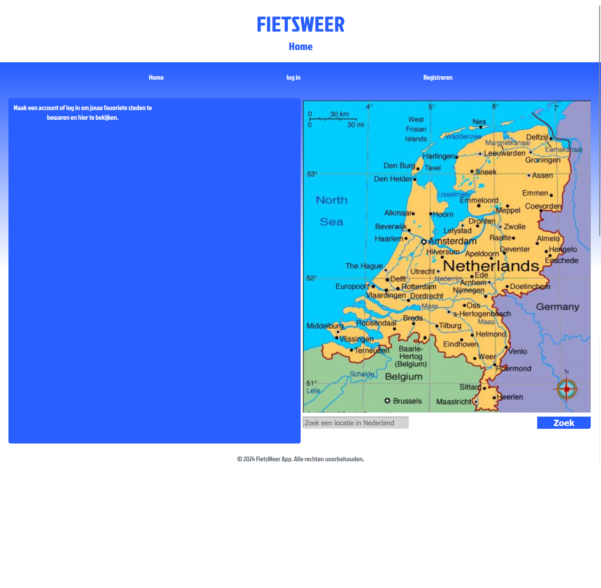

# Fietsweerapp 

## Inhoudsopgave
1. [Introductie](#introductie)
2. [Benodigdheden](#benodigdheden)
3. [Installeren](#instaleren)
4. [Extra toelichting](#extra-toelichting)

<a name="introductie"></a>
## Introductie
Deze applicatie toont het huidige weer en de weersvoorspelling voor de huidige dag. Gebruikers kunnen inloggen om hun favoriete locaties op te slaan en gepersonaliseerde weersvoorspellingen te ontvangen.



<a name="benodigdheden"></a>
## Benodigdheden


1) Voor dit project heb ik een API key van OpenWeatherMap.org (https://openweathermap.org/api) gebruikt. De benodigde API key voor beoordelaars kan worden gevonden in het functioneel ontwerp van dit project aan het einde van het document.
2) Node.js: Zorg ervoor dat je Node.js hebt geïnstalleerd.
3) NPM - Node Package Manager. 

<a name="Instaleren"></a>
## Installeren
Instructies om de applicatie te installeren en te runnen:

    1) Clone de repository 
```bash

  https://github.com/sachawindmeijer/fietsweer
```
2) Installeer de dependencies via de terminal van je IDE.

```bash
  npm install
```
3) Plak de API-sleutel zonder spaties achter de variabele in het bestand .env.dist

4) Creëer een build om het geheel werkend te krijgen.

```bash
  npm run build
```
5) Start de server

```bash
  npm run dev
```

<a name="commentaar"></a>
## Extra toelichting
Om de app te gebruiken, moet je een account registreren. De back-end van de app wordt geleverd door NOVI Hogeschool en gebruikersaccounts kunnen af en toe worden verwijderd. Daarom is het belangrijk om als tester/gebruiker/beoordelaar telkens een nieuw account aan te maken.
Tijdens de registratie moet je voldoen aan de volgende eisen:
1)    E-mailadres:
        Je e-mailadres moet een '@'-symbool bevatten.
2)    Wachtwoord:
        Je wachtwoord moet minimaal 6 tekens lang zijn.

